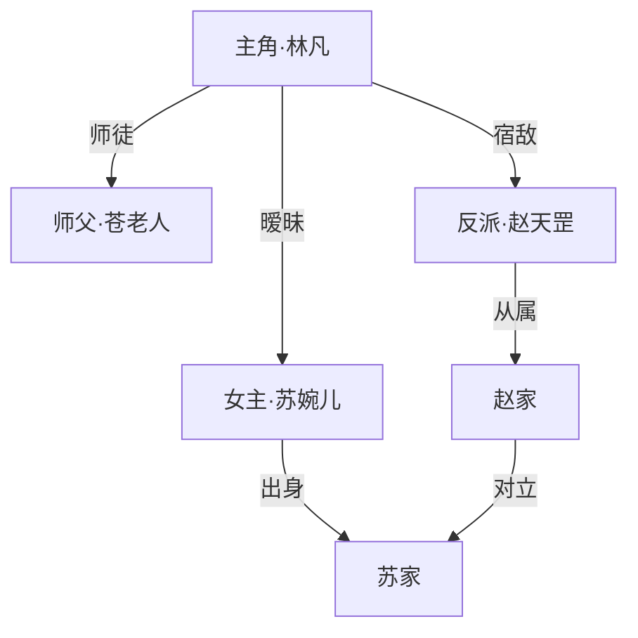
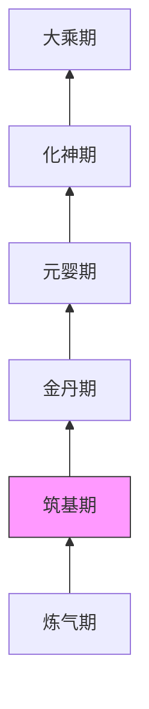

# 爽文小说生成器

根据用户提供的内容方向，自动完善提示词并生成章节制爽文小说。通过 `.learnings/` 记忆系统维护故事连续性，确保角色、地点、情节前后一致。

## 快速参考

| 场景                  | 操作                                              |
| --------------------- | ------------------------------------------------- |
| 用户提供小说方向/题材 | 执行「提示词生成流程」，必须参考 `references/prompt-guide.md` 补全各要素 |
| 开始创作新章节        | 先读取 `.learnings/` 中的记忆文件，再按下方章节模板生成 |
| 引入新角色            | 记录到 `.learnings/CHARACTERS.md`               |
| 出现新地点            | 记录到 `.learnings/LOCATIONS.md`                |
| 关键情节转折          | 记录到 `.learnings/PLOT_POINTS.md`，生成图解    |
| 生成失败/质量不佳     | 记录到 `.learnings/ERRORS.md`，分析原因         |
| 输出章节              | 按章节生成独立 md 文件到 `output/` 目录         |

---

## 工作流总览

```
用户提供方向（题材/关键词/灵感）
        ↓
  ┌─────────────────┐
  │ 1. 提示词生成    │ → 自动补全世界观、人设、冲突、节奏
  └────────┬────────┘
           ↓
  ┌─────────────────┐
  │ 2. 大纲规划      │ → 全局章节大纲（基于提示词生成）
  └────────┬────────┘
           ↓            ╱
  ┌─────────────────┐     ┌─────────────────┐
  │ 3. 逐章生成      │ ←→  │ .learnings/ 记忆 │
  └────────┬────────┘     └─────────────────┘
           ↓
  ┌─────────────────┐
  │ 4. 输出 & 图解   │ → output/第XX章.md + 关键情节图解
  └─────────────────┘
```

---

## 第一步：提示词生成与完善

收到用户的小说方向后，生成临时小说名和完善的提示词，请用户确认。

::: warning
**【强制】提示词未经用户确认之前，禁止创建项目文件夹和写入任何文件。**
:::

用户只需提供一个方向，代理自动补全为完整的创作提示词。
提示词指南见 `references/prompt-guide.md`，完整示例见 `references/examples.md`（示例一）。

### 用户输入示例

用户可能只给出一句话：

- "写一个都市修仙的爽文"
- "重生回高中逆袭成商业大亨"
- "废柴少年获得系统后一路碾压"

### 提示词自动完善流程

收到用户方向后，按以下维度结合 `references/prompt-guide.md` 的详细指导自动补全：

```
1. 题材定位    → 主类型 + 子类型（如：都市 + 修仙）
2. 世界观设定  → 力量体系、社会规则、时代背景
3. 主角人设    → 初始身份、性格、金手指/挂
4. 核心冲突    → 主线矛盾 + 前3章的即时冲突
5. 爽点设计    → 打脸节奏、升级频率、装逼方式
6. 节奏规划    → 每N章一个小高潮、每M章一个大高潮
7. 配角框架    → 对手/盟友/红颜各至少1人
8. 开篇钩子    → 第一章用什么抓住读者
```

完善后的提示词保存到 `output/提示词.md`，并请用户确认或调整。
必须参考 `references/examples.md` 中的示例一进行校验。

### 完整提示词模板

```markdown
# 《[小说名]》创作提示词

## 一、题材定位
- **主类型**: [都市/玄幻/修仙/科幻/末世/历史/游戏...]
- **子类型**: [重生/系统/穿越/废柴逆袭/退婚/赘婿...]
- **基调**: [热血/轻松/暗黑/搞笑/装逼打脸...]
- **目标读者**: [男频/女频/通用]

## 二、世界观设定
### 时代背景
[现代都市/古代仙侠/未来星际/异世界...]

### 力量体系
| 等级 | 描述 | 代表人物 |
|------|------|---------|
| 第一层 | [描述] | [举例] |
| 最高层 | [描述] | [举例] |

### 社会规则
- [核心规则1：如弱肉强食、实力至上]
- [核心规则2：如宗门体系、家族势力]

## 三、主角设定
- **姓名**: [姓名]
- **初始身份**: [越底层越好，衬托逆袭]
- **年龄**: [年龄]
- **性格**: [表面特征 + 内在特征]
- **初始困境**: [开局有多惨]
- **金手指/系统**: [具体能力和规则]
  - 能力1：[描述]
  - 限制条件：[不能无限开挂]
  - 成长路线：[如何升级]

## 四、核心冲突
### 主线矛盾
[贯穿全书的最大矛盾是什么]

### 前期冲突（第1-5章）
- 即时冲突：[开篇就面对的问题]
- 对手：[第一个被打脸的对象]
- 爽点：[第一波装逼打脸怎么打]

## 五、爽点设计
### 打脸套路（循环使用）
1. [套路1：如被嘲笑实力弱 → 一招秒杀]
2. [套路2：如被下战书 → 轻松碾压 → 众人震惊]

### 升级节奏
- 每 [N] 章突破一次小等级
- 每 [M] 章突破一次大境界

## 六、配角框架
### 盟友
| 姓名 | 身份 | 与主角关系 | 作用 |
|------|------|-----------|------|
| [名] | [身份] | [关系] | [推动剧情/提供助力] |

### 对手/反派
| 姓名 | 身份 | 与主角矛盾 | 结局 |
|------|------|-----------|------|
| [名] | [身份] | [矛盾] | [被打脸/洗白/死亡] |

### 红颜/CP
| 姓名 | 身份 | 感情线 | 作用 |
|------|------|--------|------|
| [名] | [身份] | [发展] | [助力/牵挂/动力] |

## 七、开篇设计
### 前三章节奏
- 第1章：[核心事件] → 读者情绪：[好奇/同情/期待]
- 第2章：[核心事件] → 读者情绪：[紧张/兴奋]
- 第3章：[核心事件] → 读者情绪：[爽快/震惊] ← 第一个爽点高潮

## 八、风格指南
- **叙述视角**: [第一人称/第三人称有限/全知]
- **语言风格**: [简洁干练/古风韵味/幽默吐槽/中二热血]
- **每章字数**: [2000-3000字]
```

### 快速提示词模板

适用于用户方向明确、不需要太多细节的快速创作：

```markdown
# 《[小说名]》快速提示词

- **类型**: [类型]
- **主角**: [姓名]，[身份]，获得[金手指]
- **开局**: [初始困境]
- **主线**: [核心目标]
- **第一个爽点**: [第一次打脸的场景]
- **等级体系**: [从低到高列出]
- **风格**: [语言风格]
- **每章字数**: 2000-3000
```

### 提示词质量检查

完善后自检以下项：

- [ ] 主角有明确的"逆袭起点"（够惨才够爽）
- [ ] 金手指/系统有清晰的规则和限制
- [ ] 前三章至少有一个"打脸"场景设计
- [ ] 力量体系有明确层级（便于体现碾压感）
- [ ] 有至少一个"众人皆看不起 → 被打脸"的经典结构

---

## 第二步：大纲规划

在提示词确认后、正式写作前，先生成全局大纲。
情节结构参考：`references/plot-structures.md`。

::: warning
**【强制】在生成大纲之前，必须先询问用户目标总字数。**
- 用户必须明确告知计划写多少字（建议范围：10万~200万字）
- 禁止在未获得用户确认前直接生成大纲
:::

### 大纲结构

参考示例：`references/examples.md`（示例四）

```markdown
# 《小说名》大纲

## 1. 基本信息
- **小说名**：[小说名]
- **题材**：[题材]
- **每章字数**：2000-3000字
- **总字数**：约XX万字
- **总章节数**：约XXX章

---

## 2. 世界观设定

### 时代背景
[描述故事发生的时代和环境]

### 社会规则
- [核心规则1]
- [核心规则2]

### 风格指南
- **叙述视角**：[第一人称/第三人称有限/全知]
- **语言风格**：[简洁干练/古风韵味/幽默吐槽/中二热血]
- **章节命名**：[命名规则]

### 系统机制详解（如有）
[金手指/系统的详细规则]

### 力量/等级体系
| 等级 | 称号 | 解锁内容 |
|------|------|---------|
| 1级 | 新手 | [初始能力] |
| 最高级 | 巅峰 | [终极能力] |

### 主角能力详解
**核心技能：**
- **技能名**：效果、消耗、冷却

**标志性被动：**
- **被动名**：来源、效果

---

## 3. 势力与角色

### 势力体系说明
[主要势力分布和关系]

### 男性角色
| 角色 | 身份 | 特点 |
|------|------|------|
| [名] | [身份] | [特点] |

### 女性角色（如有）
| 角色 | 定位 | 出场 | 特点 | 独立故事线 |
|------|------|------|------|----------|
| [名] | [定位] | [卷/章] | [特点] | [独立线] |

### 副本BOSS
| 角色 | 副本 | 特点 |
|------|------|------|
| [名] | [副本名] | [特点] |

---

## 4. 副本设计

### 第一副本：[副本名]
| 项目 | 内容 |
|------|------|
| **副本等级** | X-X级 |
| **推荐等级** | X级 |
| **副本时长** | 第X-Y章 |
| **背景** | [背景] |
| **主线任务** | [任务] |
| **BOSS** | [BOSS名] |
| **隐藏任务** | [隐藏任务] |
| **副本奖励** | [奖励] |
| **通关条件** | [条件] |

---

## 5. 篇章剧情走向

### 第一卷：[卷名]（第1-N章）

**核心冲突**：[核心矛盾]

**主角成长**：[从XX到XX]

**势力格局**：
| 势力 | 特点 |
|------|------|
| [势力] | [特点] |

**新增角色**：[角色名]

**爽点设计**：
- [爽点1]
- [爽点2]

**章节安排**：
| 章节 | 内容 |
|------|------|
| X-X | [内容] |

**大高潮**：第X章——[高潮内容]

---

### 第二卷：[卷名]（第N+1-M章）
...

---

## 6. 关键转折点

| 章节 | 转折内容 |
|------|---------|
| 第X章 | [转折] |
| 第X章 | [转折] |

---

## 7. 伏笔埋设与回收

### 长期伏笔
| 伏笔 | 首次埋设 | 回收章节 | 内容 |
|------|---------|---------|------|
| [伏笔名] | 第X章 | 第X章 | [内容] |

### 每卷伏笔
| 伏笔 | 首次埋设 | 回收章节 | 内容 |
|------|---------|---------|------|
| [伏笔名] | 第X章 | 第X章 | [内容] |

---

## 8. 隐藏成就线

1. **成就名**：[描述]
2. **成就名**：[描述]

---

## 9. 角色最终命运

| 角色 | 最终结局 |
|------|---------|
| [主角] | [结局] |
| [角色] | [结局] |

```

大纲保存到 `output/大纲.md`。

---

## 第三步：逐章生成

### 生成前必读

读取以下记忆文件：

::: warning
**【强制】未读取以下记忆文件，禁止生成新章节。**
- 记忆文件不完整时，必须先根据已有章节补充完善
:::

```
.learnings/CHARACTERS.md    → 当前所有角色的状态
.learnings/LOCATIONS.md     → 已出现的地点
.learnings/PLOT_POINTS.md   → 已发生的关键情节
.learnings/STORY_BIBLE.md   → 世界观设定和规则
```

### 生成前：写作计划确认

::: warning
**【强制】完成写作计划确认前，禁止开始生成正文。**
:::

对照 `output/大纲.md`，确认以下内容：

```
=== 本章写作计划 ===

【章节定位】本章是第XX章，属于第X卷"[卷名]"

【篇章对照】根据大纲"篇章剧情走向"：
- 本卷核心冲突：[对照]
- 本卷主角成长线：[对照 - 从XX到XX]
- 本卷势力格局：[对照]
- 本卷新增角色：[对照]

【副本进度】如涉及副本：
- 当前副本：[副本名]
- 副本进度：第X-Y章
- 本章应完成：[主线任务/隐藏任务]

【能力对照】根据大纲"主角能力详解"：
- 当前能力：[当前等级/已解锁技能]
- 本章应成长：[新技能/等级提升]

【势力对照】根据大纲"势力与角色"：
- 相关势力动态：[本章涉及哪些势力]
- 关系变化：[敌对/盟友/中立]

【隐藏成就】根据大纲"隐藏成就线"：
- 本章是否触发：[成就名]的解锁条件

【伏笔状态】根据大纲"伏笔埋设与回收"：
- 本章需回收：[伏笔ID]
- 本章可埋设：[新伏笔]

【关键转折】根据大纲"关键转折点"：
- 本卷转折点：[列表]
- 本章是否涉及：[是/否]

【上章回顾】
- 主角状态：
- 关键事件：
- 未解决的伏笔：

【确认】□ 已对照大纲全维度确认，准备开始生成
```

---

### 章节质量标准

| 要素   | 要求                                       |
| ------ | ------------------------------------------ |
| 节奏   | 每章至少一个小爽点，不能平淡流水           |
| 冲突   | 每章有明确的矛盾推动情节                   |
| 悬念   | 章末必须设置钩子，让人想看下一章           |
| 连贯性 | 与前文角色状态、地点描写、已有情节保持一致 |
| 递进感 | 主角能力/地位/见识要有可感知的成长         |
| 对话   | 对话要有个性差异，反派不能太蠢             |

### 爽文节奏公式

```
每 1-2 章：小打脸（碾压小角色、获得小收获）
每 3-5 章：中打脸（击败阶段性对手、突破等级）
每 8-12 章：大高潮（翻转局势、揭示真相、大规模碾压）
每 15-20 章：卷终决战（解决卷级矛盾、主角阶段性质变）
```

### 章节生成模板

每章按以下结构生成（纯文本格式，无任何 Markdown 标记）：
章节正文示例见 `references/examples.md`（示例二）

```
第XX章 [章节名]

【本章概要】一句话概括本章核心事件
【本章爽点】本章主要的爽感来源（打脸/突破/获宝/逆转...）
【情绪曲线】[低开高走 / 层层递进 / 反转爆发 / 紧张释放]
【涉及角色】[本章出场的角色列表]
【涉及地点】[本章场景所在地]


（正文内容，2000-3000字）

（开篇：承接上章 / 场景切入 / 对话开场）
（发展：矛盾升级 / 信息揭示 / 力量展示）
（高潮：本章爽点 / 冲突爆发 / 反转发生）
（收束：结果呈现 / 众人反应 / 章末钩子）


【章末钩子】[留下的悬念，引导继续阅读]
【下章预告】[下一章将要发生什么的简要提示]
```

### 特殊章节模板

**战斗章节：**
```
第XX章 [战斗章节名]

【战斗双方】[A] vs [B]
【实力对比】[A的等级/实力] vs [B的等级/实力]
【胜负关键】[什么因素决定了胜负]
【爽点类型】碾压 / 逆转 / 苦战后爆发


（战前：对峙、挑衅、众人不看好主角）
（战中：交手、试探、劣势、爆发）
（战后：众人震惊、对手不甘、收获战利品）
```

**突破章节：**
```
第XX章 [突破章节名]

【突破内容】从[当前等级]突破到[新等级]
【突破契机】[战斗感悟/奇遇/丹药/秘境]
【异象描写】[突破时的天地异象]
【实力提升】[具体增强了什么能力]


（突破前：积累、感悟、临门一脚）
（突破中：天地异象、能量涌入、众人震惊）
（突破后：实力验证、碾压式展示新力量）
```

**转折章节：**
```
第XX章 [转折章节名]

【转折类型】身世揭秘 / 背叛 / 真相大白 / 新敌出现
【影响范围】[这个转折会影响后续多少章的走向]
【情绪冲击】[读者应该感受到什么情绪]


（铺垫：看似正常的日常/任务）
（异常：某个细节引起注意）
（揭示：真相浮出水面）
（冲击：角色和读者的情绪反应）
```

### 章节字数检查

::: warning
**【强制】字数统计必须使用 `scripts/check_chapter_wordcount.py` 脚本，禁止AI自行估算。每章字数必须控制在 2000-3000 字范围内，超出或不足都必须调整至达标后方可移入 output/。**
:::

```bash
# 检查单个章节（必须执行）
python scripts/check_chapter_wordcount.py output/第01章_章节名.md

# 检查所有章节
python scripts/check_chapter_wordcount.py --all
```

### 章节生成后：偏离检测

::: warning
**【强制】字数检查通过后、进入检查清单前，必须完成偏离检测。未通过偏离检测的章节禁止移入 output/。**
:::

生成章节后，对照 `output/大纲.md` 进行偏离检测：

```
=== 偏离检测 ===

【本章目标】根据大纲，本章应完成：
1. [对照大纲列出本章应该发生的事件]
2. [对照大纲列出本章应该推进到的阶段]

【实际结果】本章实际写了：
1. [实际发生的事件]
2. [实际推进到的阶段]

【偏离判定】
□ 无偏离 — 本章完全符合大纲
□ 轻度偏离 — [列出具体偏移点，但不影响主线，可接受]
□ 严重偏离 — [列出具体偏移点，已影响主线走向，必须修正]

【偏离详情】（如有偏离，填写以下内容）
- 偏移事件：
- 大纲预期：
- 实际走向：
- 修正建议：

【爽点节奏检查】
- 本章是否有明确爽点？[是/否]
- 如有，是哪种类型？[打脸/突破/获宝/逆转/其他]
- 如否，说明原因：

【结论】
✓ 通过检测 — 可以进入检查清单
✗ 需要修正 — 请根据【修正建议】重写或调整
```

**多维度偏离检测：**

```
【副本进度检查】
- 大纲要求：[副本任务进度]
- 实际进度：[实际写到的进度]
- 判定：□ 符合 □ 偏离

【能力成长检查】
- 大纲设定本章能力：[等级/技能]
- 实际展现：[当前章节展现的能力]
- 判定：□ 符合 □ 偏差

【势力关系检查】
- 大纲本章势力动态：[关系变化]
- 实际描写：[实际写到的势力关系]
- 判定：□ 符合 □ 偏差

【成就触发检查】
- 本章应触发：[成就名]
- 实际是否触发：[是/否]
- 判定：□ 已触发 □ 未触发

【伏笔埋设/回收检查】
- 应回收伏笔：[伏笔ID列表]
- 实际回收：[已回收/未回收]
- 应埋设伏笔：[新伏笔]
- 实际埋设：[已埋设/未埋设]
```

**偏离判定标准：**

| 级别 | 描述 | 处理方式 |
|------|------|----------|
| 无偏离 | 本章完全在大纲框架内 | 直接通过 |
| 轻度偏离 | 局部细节不一致，但主线正确 | 记录但不阻断，可修正后通过 |
| 严重偏离 | 主线走向错误、关键事件遗漏或添加了不该发生的重大事件 | 必须修正后才能通过 |

**常见偏离场景：**

| 偏离类型 | 表现 | 严重程度 |
|----------|------|----------|
| 跳过关键事件 | 大纲要求第N章发生A事件，但直接跳到了B事件 | critical |
| 角色提前出现 | 大纲第N章才出场的角色，在第M章就出现了 | high |
| 等级/境界错误 | 主角还没到大纲设定的境界，却表现出更高境界的能力 | high |
| 势力关系错误 | 把敌对势力写成盟友，或反之 | critical |
| 世界观规则违反 | 出现了违反 STORY_BIBLE.md 中核心规则的设定 | critical |
| 支线喧宾夺主 | 大纲中的小支线变成了本章主线 | medium |

---

### 章节生成检查清单

每章生成后自检：

::: warning
**【强制】未通过以下全部检查的章节，禁止移入 output/ 目录或用于后续章节生成。**
:::

**连贯性检查：**
- [ ] 与上一章结尾衔接自然
- [ ] 角色状态与 CHARACTERS.md 一致（等级、伤势、位置）
- [ ] 地点描写与 LOCATIONS.md 一致
- [ ] 未违反 STORY_BIBLE.md 中的设定规则
- [ ] 未与 PLOT_POINTS.md 中已有情节矛盾

**质量检查：**
- [ ] 本章有明确的爽点或情节推进
- [ ] 对话有角色个性差异
- [ ] 章末有钩子/悬念
- [ ] 主角有可感知的成长或收获
- [ ] 已使用 `scripts/check_chapter_wordcount.py` 统计字数

**记忆更新检查：**
- [ ] 新角色已记录到 CHARACTERS.md
- [ ] 角色状态变化已更新
- [ ] 新地点已记录到 LOCATIONS.md
- [ ] 关键情节已记录到 PLOT_POINTS.md
- [ ] 如有关键场景，已生成图解

---

## 第四步：记忆管理

记忆文件条目示例见 `references/examples.md`（示例三）。

### 记忆文件模板

**CHARACTERS.md：**
```markdown
# 角色档案

记录所有已出场角色的信息，每次生成新章节前必读。

**更新规则**：新角色出场时添加，角色状态变化时更新，角色死亡时标记。

---

## [角色姓名]

**首次出场**: 第XX章
**身份**: [身份描述]
**阵营**: 主角方 | 敌对 | 中立
**等级/实力**: [当前等级]
**当前状态**: 活跃 | 受伤 | 失踪 | 死亡
**性格特征**: [2-3个关键词]
**与主角关系**: [关系描述]
**标志性特征**: [外貌/口头禅/习惯等辨识特征]

### 经历摘要
- 第XX章：[关键事件]
```

**LOCATIONS.md：**
```markdown
# 地点档案

记录所有已出现的地点信息，确保空间描写一致。

**更新规则**：新地点出现时添加，地点发生变化（被毁/升级）时更新。

---

## [地点名称]

**首次出场**: 第XX章
**类型**: 城市 | 宗门 | 秘境 | 战场 | 居所 | 其他
**所属势力**: [势力名]
**地理位置**: [相对位置描述]
**环境特征**: [2-3个关键描述]
**重要事件**: [在此地发生过什么]
**当前状态**: 正常 | 被毁 | 封禁 | 已离开
```

**PLOT_POINTS.md：**
```markdown
# 关键情节档案

记录所有关键情节点，维护故事主线连贯性。

**更新规则**：每章生成后记录关键事件，标注是否有未解决的伏笔。

---

## [PLOT-YYYYMMDD-XXX] 情节标题

**章节**: 第XX章
**记录时间**: ISO-8601
**类型**: 主线推进 | 伏笔埋设 | 伏笔回收 | 转折点 | 打脸 | 突破
**状态**: 进行中 | 已完结 | 伏笔待回收

### 事件描述
[发生了什么]

### 涉及角色
[哪些角色参与]

### 后续影响
[这个情节会影响后续什么]
```

**STORY_BIBLE.md：**
```markdown
# 故事圣经

世界观核心设定，一经确立不可随意修改。新设定补充时追加。

---

## 世界观基础
[基本世界背景]

## 力量体系
[完整等级体系和规则]

## 核心规则
[这个世界的基本法则，如：实力至上、弱肉强食]

## 禁忌/限制
[什么是绝对不能打破的设定]

## 主线目标
[全书终极目标]
```

### 写入时机

| 事件                             | 记录到             | 何时写入               |
| -------------------------------- | ------------------ | ---------------------- |
| 新角色出场                       | `CHARACTERS.md`  | 该章生成完毕后立即写入 |
| 角色状态变化（升级、受伤、死亡） | `CHARACTERS.md`  | 更新对应角色条目       |
| 新地点出现                       | `LOCATIONS.md`   | 该章生成完毕后立即写入 |
| 关键情节发生                     | `PLOT_POINTS.md` | 该章生成完毕后立即写入 |
| 世界观规则补充                   | `STORY_BIBLE.md` | 发现新设定时立即写入   |
| 生成失败或质量差                 | `ERRORS.md`      | 失败后立即记录原因     |

::: warning
**【强制】每章生成完毕后，必须立即更新对应记忆文件，未更新的记忆文件禁止用于下一章生成。**
:::

### 读取时机

读取所有记忆文件，确保：

::: warning
**【强制】未完整读取记忆文件，禁止生成新章节。**
:::

- 不会让已死角色复活
- 不会把"东城"写成"西城"
- 不会忘记上一章埋的伏笔
- 不会重复已有的情节桥段

---

## 第五步：关键情节图解

当出现以下场景时，生成对应的图解：

| 场景       | 图解内容                     |
| ---------- | ---------------------------- |
| 关键战斗   | 双方站位、力量对比、胜负关键 |
| 势力地图   | 各方势力的关系与分布         |
| 等级突破   | 角色成长路线图               |
| 人物关系   | 主要角色关系网               |
| 重大剧情线 | 剧情时间线/因果链            |

图解使用 Mermaid 语法嵌入 md 文件，或使用图像生成工具生成。

### 图解示例（Mermaid）

**人物关系图：**



**等级体系图：**



---

## 第六步：失败记录

生成失败或质量不达标时，记录到 `.learnings/ERRORS.md`。

### 常见失败场景

| 失败类型 | 描述                 | 记录内容                   |
| -------- | -------------------- | -------------------------- |
| 角色穿帮 | 已死角色再次出现     | 穿帮章节、角色名、正确状态 |
| 设定矛盾 | 力量体系自相矛盾     | 矛盾点、涉及章节、修正方案 |
| 节奏失控 | 连续多章无爽点       | 失控起始章节、节奏分析     |
| 情节重复 | 相似桥段反复出现     | 重复内容、首次出现位置     |
| 人设崩塌 | 角色行为违背人设     | 角色名、崩塌行为、原始人设 |
| 生成中断 | 技术原因导致生成失败 | 错误信息、中断位置         |

### 失败记录格式

```markdown
## [NOVEL-ERR-YYYYMMDD-XXX] 失败类型

**记录时间**: ISO-8601
**章节**: 第XX章
**严重程度**: low | medium | high | critical

### 问题描述
具体发生了什么

### 影响范围
影响了哪些章节、角色、情节线

### 修正方案
如何修复，是否需要重写

### 预防措施
如何避免同类问题再次发生
```

---

## 输出规范

### 文件结构

```
output/
├── 提示词.md           # 完善后的创作提示词
├── 大纲.md             # 全局章节大纲
├── 第01章_[章名].md    # 各章节独立文件
├── 第02章_[章名].md
├── 第03章_[章名].md
├── ...
├── 人物关系图.md        # 关键图解
├── 势力分布图.md
└── 等级体系图.md
```

### 文件命名规范

- 章节文件：`第XX章_章节名.md`（XX 用两位数字，如 01、02）
- 图解文件：`[图解类型].md`
- 如果超过 99 章，使用三位数字：`第XXX章_章节名.md`

---

## 创作原则

### 爽文核心要素

1. **强代入感** — 读者能轻松代入主角视角
2. **快节奏** — 不拖泥带水，每章有进展
3. **层层递进** — 敌人越来越强，主角越来越猛
4. **装逼打脸** — 被小看 → 展示实力 → 众人震惊，循环往复
5. **金手指合理** — 有挂但有规则，不是无限制开挂
6. **伏笔呼应** — 前文埋下的线索后文要收回来

### 禁忌事项

::: warning
**【强制】以下禁忌必须严格遵守，违反将导致故事质量严重下降。**
:::

- 不要连续两章以上没有爽点
- 不要让反派太愚蠢（衬托不出主角的强）
- 不要忘记已有角色（出场后人间蒸发）
- 不要突然修改已确立的设定
- 不要让主角无缘无故变弱（除非有合理剧情需要）

---

### 初始化新小说

::: warning
**【强制】用户确认提示词（包含小说名）后，必须立即运行初始化脚本创建项目工作区。**
:::

```bash
${SKILL_DIR}/scripts/init-novel.sh <小说名>
```

这会创建 `小说名/` 文件夹，包含：
- `output/` - 章节输出目录
- `references/` - 参考指南
- `.learnings/` - 记忆文件
- `scripts/` - 脚本工具（不含 init-novel.sh）
